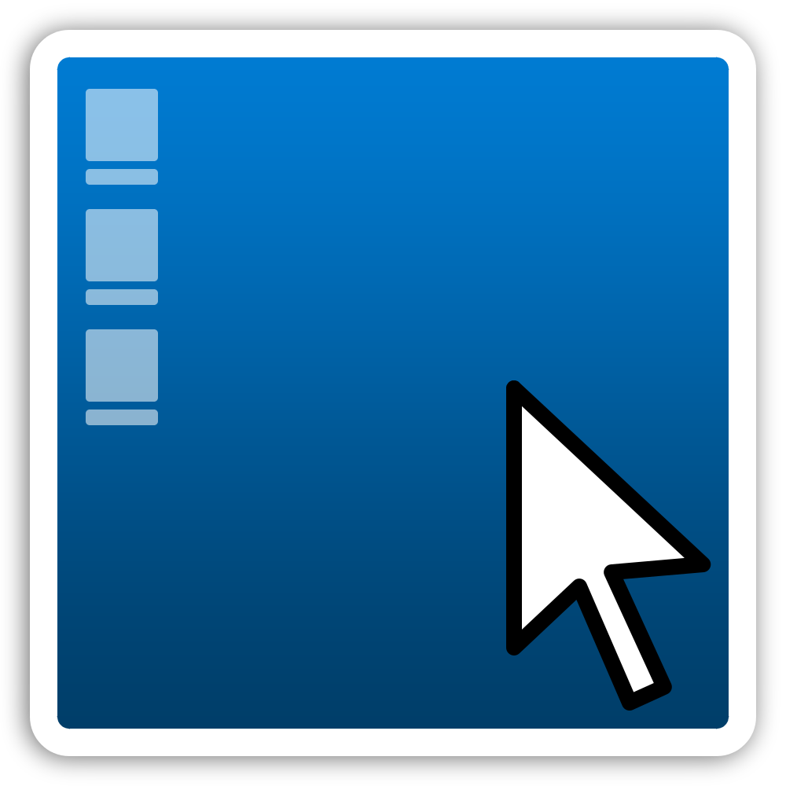

<!-- PROJECT LOGO -->
 

  

  <h3 align="center">DCTHDI</h3>

  

    Double click to hide desktop icons!
     
     
    <a href="https://github.com/raphl1/DCTHDI/issues">Report Bug</a>
    ·
    <a href="https://github.com/raphl1/DCTHDI/issues">Request Feature</a>
  

<!-- TABLE OF CONTENTS -->

  
Table of Contents

  <ol>
    <li>
      <a href="#about-the-project">About The Project</a>
      <ul>
        <li><a href="#built-with">Built With</a></li>
      </ul>
    </li>
    <li>
      <a href="#getting-started">Getting Started</a>
      <ul>
        <li><a href="#installation">Installation</a></li>
      </ul>
    </li>
    <li><a href="#roadmap">Roadmap</a></li>
    <li><a href="#contributing">Contributing</a></li>
    <li><a href="#license">License</a></li>
    <li><a href="#donate">Buy Me A Coffee</a></li>
    <li><a href="#acknowledgments">Acknowledgments</a></li>
  </ol>

<!-- ABOUT THE PROJECT -->
## About The Project

[![Easily hide your desktop icons by double-clicking on the desktop][product-screenshot]](https://github.com/raphl1/DCTHDI)

Easily hide your desktop icons by double-clicking on the desktop

(<a href="#readme-top">back to top</a>)

### Built With

* AutoHotkey

(<a href="#readme-top">back to top</a>)

<!-- GETTING STARTED -->
## Getting Started

Download the Latest Release [here](https://github.com/raphl1/DCTHDI/releases)

### Installation

_Below is an example of how you can instruct your audience on installing and setting up your app. This template doesn't rely on any external dependencies or services._

1. Download the release [here](https://github.com/raphl1/DCTHDI/releases)
2. Open the .exe file (Note: You might get a warning from Windows SmartScreen this is because this file is not signed)
3. Double click on your desktop

(<a href="#readme-top">back to top</a>)

<!-- ROADMAP -->
## Roadmap

- [x] Add initial features
- [ ] Re-assignable hotkey

See the [open issues](https://github.com/raphl1/DCTHDI/issues) for a full list of proposed features (and known issues).

(<a href="#readme-top">back to top</a>)

<!-- CONTRIBUTING -->
## Contributing

Contributions are what make the open source community such an amazing place to learn, inspire, and create. Any contributions you make are **greatly appreciated**.

If you have a suggestion that would make this better, please fork the repo and create a pull request. You can also simply open an issue with the tag "enhancement".
Don't forget to give the project a star! Thanks again!

1. Fork the Project
2. Create your Feature Branch (`git checkout -b feature/AmazingFeature`)
3. Commit your Changes (`git commit -m 'Add some AmazingFeature'`)
4. Push to the Branch (`git push origin feature/AmazingFeature`)
5. Open a Pull Request

(<a href="#readme-top">back to top</a>)

<!-- LICENSE -->
## License

Distributed under the MIT License. See `LICENSE.txt` for more information.

(<a href="#readme-top">back to top</a>)

<!-- Buy Me a coffee -->
## Donate

Support the project by buying me a coffee - [https://www.buymeacoffee.com/raphl1](https://www.buymeacoffee.com/raphl1)

(<a href="#readme-top">back to top</a>)

<!-- ACKNOWLEDGMENTS -->
## Acknowledgments

Thanks to the following

* Icons by [Icons8](https://icons8.com/)

(<a href="#readme-top">back to top</a>)

<!-- MARKDOWN LINKS & IMAGES -->
<!-- https://www.markdownguide.org/basic-syntax/#reference-style-links -->
[product-screenshot]: images/demo.gif
